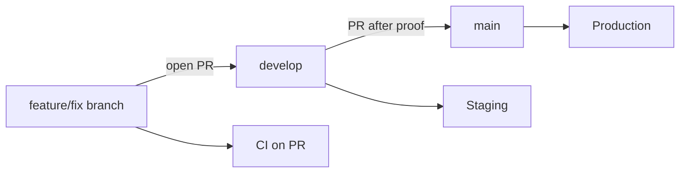

# Git workflow — `develop` + pull requests

Navomnis uses a **two-branch integration model**: day-to-day work merges into **`develop`** via PR; **`main`** receives controlled promotions after CI and staging proof.

## Branches

| Branch | Purpose | Deploy target (when configured) |
|--------|---------|----------------------------------|
| **`main`** | Production-ready history; release tags | Production (Vercel + Railway) |
| **`develop`** | Integration branch; always deployable to staging | Staging |
| **`feature/*`**, **`fix/*`**, **`chore/*`** | Short-lived topic branches | None (CI only via PR) |

`main` and `develop` should stay aligned after each release merge. Feature branches are created from **`develop`**, not from `main`.

## Flow



### 1. Start work

```bash
git fetch origin
git checkout develop
git pull origin develop
git checkout -b feature/short-description
```

Use [Conventional Commits](https://www.conventionalcommits.org/) (`feat:`, `fix:`, `chore:`, `docs:`, `test:`). Husky runs `lint` on commit and commitlint on the message.

### 2. Open PR → `develop`

Push the branch and open a pull request **into `develop`**:

```bash
git push -u origin feature/short-description
```

With [GitHub CLI](https://cli.github.com/):

```bash
gh pr create --base develop --title "feat: short description" --body "Summary and test plan."
```

**CI (required before merge):**

- Workflow [`.github/workflows/ci.yml`](../.github/workflows/ci.yml) runs on every PR: `quality` then `integration`.
- [`.github/workflows/security.yml`](../.github/workflows/security.yml) runs Gitleaks.

Merge when checks are green and review is done (if your team uses review).

### 3. Staging on `develop`

Pushes to **`develop`** can trigger staging deploy (see [`.github/workflows/deploy.yml`](../.github/workflows/deploy.yml) when secrets are set). After merge, run [v1-internal-test-script.md](./v1-internal-test-script.md) against the staging URL and log in [staging-proof-log.md](./staging-proof-log.md).

### 4. Release PR → `main`

When `develop` is validated for a release:

```bash
git checkout develop
git pull origin develop
gh pr create --base main --head develop --title "release: internal V1 pilot YYYY-MM-DD"
```

Or open the PR in GitHub: **base `main` ← compare `develop`**.

After merge to `main`:

- Production deploy runs (if `VERCEL_TOKEN` / `RAILWAY_TOKEN` are configured).
- Update [ci-verification-log.md](./ci-verification-log.md) with the merge commit on `main`.
- Sync `develop` with `main` if needed: merge `main` back into `develop` or fast-forward `develop` after release.

### 5. Hotfix on `main` (exception)

Urgent production fixes may branch from `main` (`hotfix/...`), PR to `main`, then **merge `main` back into `develop`** so branches do not diverge.

## GitHub repository settings (recommended)

Configure in **Settings → Branches → Branch protection rules**:

| Rule | `develop` | `main` |
|------|-----------|--------|
| Require PR before merging | Yes | Yes |
| Require status checks | `quality`, `integration` | `quality`, `integration` |
| Require branches up to date | Optional | Recommended |
| Do not allow bypass | Team policy | Yes for production |

Exact names appear in the Actions tab after the first CI run on a PR.

## What runs where

| Event | CI | Deploy |
|-------|-----|--------|
| PR → `develop` or `main` | Yes | No |
| Push `develop` | Yes | Staging (if secrets) |
| Push `main` | Yes | Production (if secrets) |

## Related docs

- [release-proof-runbook.md](./release-proof-runbook.md)
- [ci-integration.md](./ci-integration.md)
- [staging.md](./staging.md)
- [ci-verification-log.md](./ci-verification-log.md)
